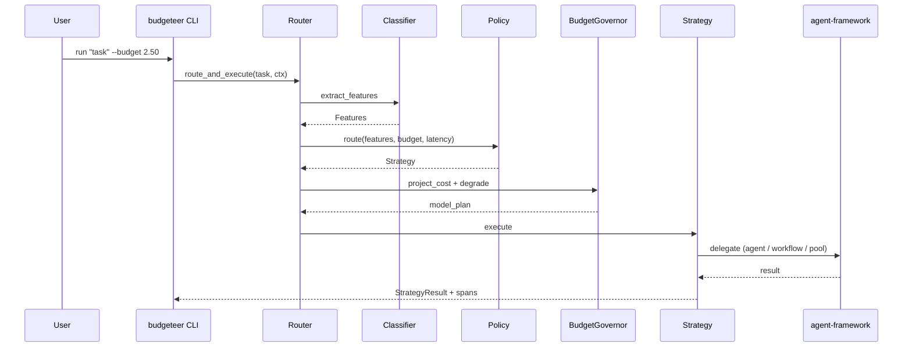

# agent-budgeteer

Runtime router that picks an execution strategy for an AI coding task based on
task features, repo shape, remaining USD budget, and a latency target — on top
of [microsoft/agent-framework][af].

## Badges

[](https://github.com/patschmitt91/AgentBudgeteer/actions/workflows/ci.yml)
[](https://github.com/patschmitt91/AgentBudgeteer/actions/workflows/codeql.yml)


## Status

Alpha / research prototype, v0.2.0. Routing pipeline and three strategies
are wired end-to-end; adapters are exercised with mocks in tests (103
tests, 89% coverage). The first live-provider micro-bench is scaffolded
under [`bench/live/`](bench/live/README.md) but no cassette has been
recorded yet — see that README for the gated recording protocol (AB-6).

v0.2 added the cross-run rolling-window budget cap
([ADR-0005](docs/decisions/0005-cross-run-budget-ledger.md)) so 100
sequential `budgeteer run` invocations can no longer blow a monthly
budget while every individual run respects its per-run cap.

## What it does

`budgeteer run "<task>"` classifies the task (seven regex/count heuristics),
picks one of three strategies (`SingleAgent`, `PCIV`, `Fleet`) via a decision
tree in `config/policy.yaml`, projects the USD cost, applies a degradation
rule if the projection exceeds a fraction of the remaining budget, then
delegates execution to the chosen strategy. All cost and token accounting is
emitted as OpenTelemetry spans.

## Why it might matter

[agent-framework][af] ships single-agent, graph-workflow, and parallel
worker-pool primitives, but topology selection is a build-time choice. Cost,
latency, and accuracy envelopes differ across topologies; a router that
chooses per task and per budget is a small composable layer above the
framework. Evaluation target is the
[SWE-bench Verified](https://www.swebench.com/) split.

## Install

```
uv sync
```

Requires Python 3.11+ and `uv`. The Anthropic adapter is the only
live-provider path today; set `ANTHROPIC_API_KEY` before `budgeteer run`.

## Quickstart

Install dependencies, run the environment check, exercise a dry-run, then
build and run the container.

```
$ uv sync
$ uv run budgeteer doctor
$ uv run budgeteer run "Rename User to Account across src/" --budget 2.50 --max-latency 600 --dry-run
$ docker build -t agent-budgeteer:0.2.0 .
$ docker run --rm agent-budgeteer:0.2.0 doctor
```

Expected output shape (dry-run, no network):

```
{
  "dry_run": true,
  "features": { "token_count": ..., "planning_depth": ..., ... },
  "decision": { "strategy": "fleet", "model": "anthropic-fallback",
                "reason": "high file_count, low coupling" }
}
```

## Architecture



See [docs/architecture.md](docs/architecture.md) for the full view.

## Strategies

| Strategy    | Shape                                      | v0 picks when                         |
|-------------|--------------------------------------------|---------------------------------------|
| SingleAgent | One streaming agent call                   | Default / large context / tight budget |
| PCIV        | Plan → critique → implement → verify       | Reasoning-heavy, tests present         |
| Fleet       | N parallel workers in git worktrees        | High file count, low coupling          |

The `PCIV` strategy delegates to the sibling
[pciv](https://github.com/patschmitt91/PCIV) project; see that repo for the
pipeline internals.

## Configuration

All thresholds, pricing, projection coefficients, degradation rules, and
classifier wordlists live in [config/policy.yaml](config/policy.yaml). Every
key is documented in [docs/configuration.md](docs/configuration.md).

### Cross-run budget enforcement

Per-run `--budget` is a single-process cap. To bound spend across many
sequential `budgeteer run` invocations, set `[cross_run].cap_usd` (and
optionally `window` and `db_path`) in `policy.yaml`. The CLI mounts a
SQLite-backed `agentcore.budget.PersistentBudgetLedger` and (a) refuses
to start a run when the rolling window is exhausted, (b) caps the
per-run governor's hard limit to the cross-run remaining so the
router's tight-budget guard sees the smaller of the two figures, and
(c) records the actual cost after the run completes. See
[ADR-0005](docs/decisions/0005-cross-run-budget-ledger.md) and
[tests/test_cross_run_budget.py](tests/test_cross_run_budget.py).

For documented emergencies, `budgeteer run --ignore-cross-run-cap`
skips the preflight check (the per-run `--budget` still applies),
logs a WARNING, and records the spend with `forced=1` in the
`budget_window` audit table.

## Benchmarks

Two bench surfaces:

- **Routing-accuracy.** Ten dry-run fixture tasks under
  [bench/](bench/README.md) regression-test the policy decision tree
  with no model calls.
- **Live-provider micro-bench (AB-6).** Hand-rolled cassette format
  under [bench/live/](bench/live/README.md). Replay-by-default runs in
  CI; live recording is gated behind `BENCH_LIVE=1` and a per-task
  `PersistentBudgetLedger` hard cap. The first task fixture targets
  `anthropic-fallback` with a $0.05 cap; no cassette has been recorded
  yet, so the replay test currently skips with a clear reason.

## Roadmap

Dated milestones live in [docs/roadmap.md](docs/roadmap.md). The next
milestone (v0.3) is the learned decision-tree policy trained on bench
outcomes plus the first recorded live cassettes.

## Development

Common tasks are wired through a top-level [`justfile`](justfile). Install
[`just`](https://github.com/casey/just), then:

```
just install     # uv sync --extra dev --extra learn
just lint        # ruff check
just fmt         # ruff format
just typecheck   # mypy
just test        # pytest with coverage gate
just cov         # pytest + coverage XML
just build       # uv build (sdist + wheel into dist/)
just clean       # remove dist/, caches, .coverage
```

`just` is not required — each recipe is a one-liner that shells out to
`uv`, so the underlying commands can be run directly.

## Security

See [SECURITY.md](SECURITY.md) for supported versions and how to report
a vulnerability privately.

## License and citation

MIT — see [LICENSE](LICENSE). If you cite this project in academic work:

```
@software{agent_budgeteer_2026,
  title  = {agent-budgeteer: a runtime router over microsoft/agent-framework},
  author = {agent-budgeteer contributors},
  year   = {2026},
  url    = {https://github.com/patschmitt91/AgentBudgeteer}
}
```

[af]: https://github.com/microsoft/agent-framework
