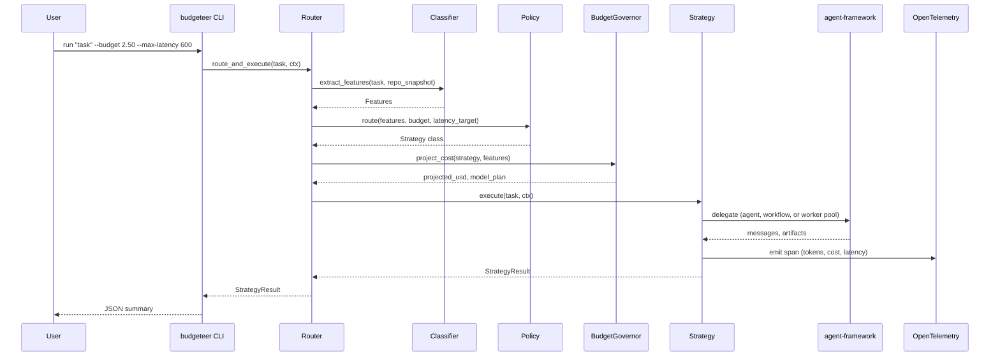

# Architecture

## Pipeline

## Relationship to agent-framework

agent-framework provides:

- Chat clients for OpenAI, Azure OpenAI, Foundry
- `Agent` with tool calling
- Workflow graphs (sequential, concurrent, handoff, group chat, Magentic-One)
- Checkpointing

agent-budgeteer uses those primitives. The `adapters/` package wraps each
backend into a narrow interface that the strategies call. The `strategies/`
package implements three execution shapes that are all built by composing
agent-framework primitives, with two exceptions noted below.

## Gaps called out against agent-framework

These are capabilities Budgeteer needs that are not currently first-class
in agent-framework. Budgeteer fills them locally.

1. **Anthropic chat client.** agent-framework ships OpenAI, Azure OpenAI,
   and Foundry chat clients. There is no built-in Anthropic chat client.
   `adapters/anthropic_adapter.py` wraps the Anthropic Python SDK in a
   shape that mirrors agent-framework's `ChatClient` surface (an async
   `get_response(messages)` style method returning a pydantic result).
   When agent-framework adds native Anthropic support, this adapter
   becomes a shim.
2. **Runtime strategy selection.** agent-framework assumes the developer
   has chosen the workflow topology at build time. Budgeteer selects
   between topologies per task. This is the entire point of Budgeteer
   and is expected to remain out of scope for agent-framework.
3. **Budget governor across strategies.** agent-framework tracks tokens
   per run. Budgeteer tracks spend against a hard USD cap and applies
   degradation rules (Opus to Sonnet on non-planning steps) before
   execution. This could move upstream if agent-framework adds a budget
   primitive.
4. **Fleet worker pool over git worktrees.** agent-framework supports
   concurrent agents but not worktree-scoped filesystems. The Fleet
   strategy manages worktrees directly and hands each worker an
   agent-framework agent.

## What this is not

- Not a replacement for agent-framework. The strategies delegate.
- Not a new agent runtime. No custom inference loop, no custom tool
  protocol.
- Not a prompt library. Prompts live in the strategies that use them and
  are not exported.

## v0 scope

- Classifier with seven heuristics, all regex or count based. Wordlists
  (reasoning, mechanical, imperative verbs) are configurable in
  ``config/policy.yaml`` under ``classifier`` so they can be tuned without
  a code change.
- Decision tree policy loaded from ``config/policy.yaml``.
- ``SingleAgent`` strategy implemented against the Anthropic SDK with
  explicit client-level timeout and retry settings.
- ``PCIV`` strategy delegates to the sibling ``pciv`` project through a
  pure-function ``PCIVRunner`` boundary. The strategy translates pciv's
  run report into Budgeteer's uniform ``StrategyResult`` and charges
  actual spend against the Budgeteer budget governor.
- ``Fleet`` strategy runs N workers through a ``ThreadPoolExecutor``,
  coordinates via a SQLite ``ShardLedger``, and provisions per-worker
  git worktrees (or tempdirs when the repo is not git) so workers cannot
  step on each other.
- OpenTelemetry spans export to Azure Application Insights when
  ``APPLICATIONINSIGHTS_CONNECTION_STRING`` is set. Otherwise spans are
  created under a silent provider and dropped. Set
  ``BUDGETEER_CONSOLE_TRACES=1`` to route spans to stdout for local
  debugging. The CLI prints JSON on stdout, so the console exporter is
  opt-in only.
- Optional ``LearnedPolicy`` trains a ``sklearn`` ``DecisionTreeClassifier``
  on labeled bench results or JSONL examples. The trained policy predicts
  strategy only; model selection still comes from ``ModelDefaults``.
